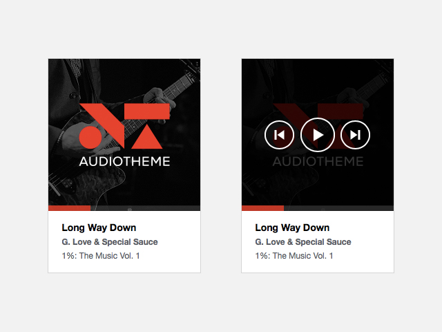

# Audiocheck jPlayer Skin

A responsive HTML5 jPlayer skin with playlist. [View Demo](https://lukemcdonald.github.io/jplayer-skin-audiocheck/)

__Contributors:__ [Luke McDonald](https://lukemcdonald.com)
__Requires:__ [jPlayer](http://jplayer.org)
__License:__ [MIT license](https://opensource.org/licenses/MIT)

Inspired by the custom audio player in the [Soundcheck WordPress theme](https://wordpress.com/blog/2012/07/12/new-theme-soundcheck/).

## Licenses

[jPlayer](http://jplayer.org) is licensed under the MIT.
Source: https://opensource.org/licenses/MIT

[Themicons](https://github.com/cedaro/themicons) is dual-licensed under the SIL Open Font License 1.1 and GPL-2.0+FE.
Source: https://github.com/cedaro/themicons/

[Soundcheck WordPress theme](https://wordpress.com/blog/2012/07/12/new-theme-soundcheck/) player design is licensed under GPL-2.0+.
Source: https://www.gnu.org/licenses/old-licenses/gpl-2.0.html
