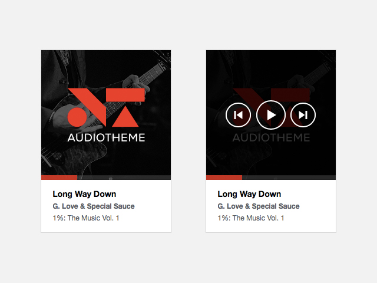

# Audiocheck jPlayer Skin

A responsive HTML5 jPlayer skin with playlist. [View Demo](https://lukemcdonald.github.io/jplayer-skin-audiocheck/)

**Contributors:** [Luke McDonald](https://lukemcdonald.com)  
**Requires:** [jPlayer](https://github.com/jplayer/jPlayer)  
**License:** [MIT license](https://opensource.org/licenses/MIT)

## Licenses

Bundled demo audio in `src/assets/media/audio/`: MDN [interactive-examples](https://developer.mozilla.org/) CC0 sample (`t-rex-roar.mp3`), plus three short [Mixkit](https://mixkit.co/) preview effects (`mixkit-arcade-bonus-alert.mp3`, `mixkit-soft-ping.mp3`, `mixkit-game-reward.mp3`) under the Mixkit Sound Effects Free License.

jPlayer is licensed under the MIT.
Source: https://opensource.org/licenses/MIT
